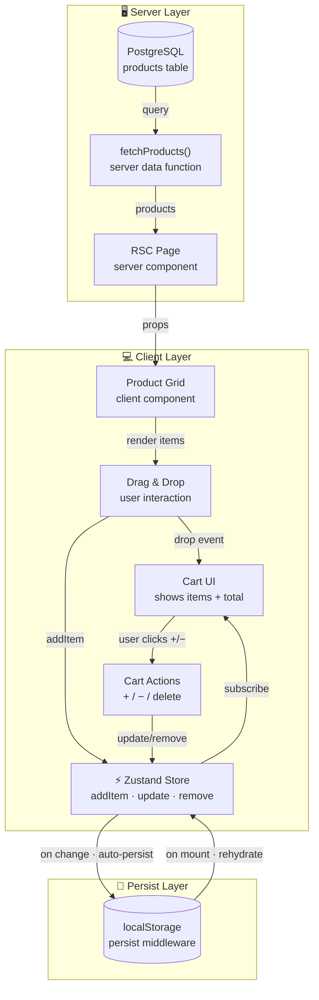
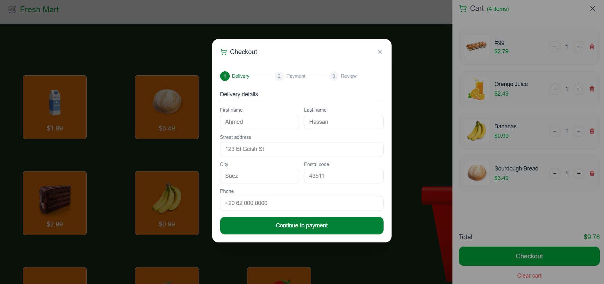

<h1 align="center" style="padding: 20px 0">🛒 Fresh Mart 🛍️</h1>

Fresh Mart is a smart shopping app that saves users time on their regular grocery runs. It features an intuitive drag-and-drop interface for building shopping lists, a live cart that tracks item quantities and prices in real time, and a smooth checkout flow where users can enter their delivery address and choose their preferred payment method.


## ✨ Features

- 🛒 **Drag & drop** - add items to cart effortlessly
- 📊 **Cart tracking** - live quantity & price updates
- 📍 **Checkout** - delivery address input
- 💳 **Payment options** - multiple methods to choose from

## 🛠️ Key Features

- **Global State** — Optimized app state using Zustand
- **Form Validation** — Using React Hook Form and Zod
- **Atomic Design** — Component architecture for easy reuse across the project
- **Grid Layout** — Established grid layout for product display and easy navigation

## ⚡ Technical Highlights

- Optimized data appearance when Zustand mounts and ensures correct data on first render
- Developed basket area tracking to detect whether a dropped item lands inside or outside the basket
- Handled card movement when the user drags items, synced with cursor or touch position
- Configured increase, decrease, and delete functionality for cart items
- Built a custom form validation hook for easy reuse across components
- Improved UX by implementing skeleton loaders while data is fetching
- Implemented a server-side data access layer using postgres to query the database directly within React Server Components, removing the need for a dedicated API route

## 💡 What I Learned

- How to implement drag and drop functionality in the app
- Unlocking the power of Zustand for global state management across the app
- Designing and syncing HTML elements with drag and drop behavior

## 🔄 data Flow



## 🚀 Getting Started

### Prerequisites

- Node.js `v20.x`
- npm (or pnpm/yarn)

### Installation

```bash
git clone https://github.com/Ahmed-Elgammal-900/fresh-mart.git
cd Quiz-App-Front-End
npm install
```

### Environment Variables

```bash
cp .env
```

| Variable       | Description            |
| -------------- | ---------------------- |
| `DATABASE_URL` | Databse connection URL |

### Run Locally

```bash
npm run dev
```

---

## 📸 Screenshots

### Products Page


### Cart Drawer


### Checkout



## ⚙️ CI/CD

Automated pipeline configured with **GitHub Actions**

---

## 📁 Project Structure

```text
.
├── app                                 # Next.js App Router
│   ├── error.tsx
│   ├── icon.tsx
│   ├── layout.tsx
│   ├── not-found.tsx
│   └── page.tsx
├── Components                          # App components
│   ├── atoms
│   │   ├── Field.tsx
│   │   └── Input.tsx
│   ├── molecules
│   │   ├── CheckoutModalHeader.tsx
│   │   ├── CompleteStatus.tsx
│   │   ├── NotAllowedScreen.tsx
│   │   ├── ProductsShowSkeleton.tsx
│   │   └── StepIndicator.tsx
│   ├── organisms
│   │   ├── Basket.tsx
│   │   ├── CardForm.tsx
│   │   ├── CartBody.tsx
│   │   ├── CartFooter.tsx
│   │   ├── CartHeader.tsx
│   │   ├── CartItem.tsx
│   │   ├── DelevieryDetails.tsx
│   │   ├── NavBar.tsx
│   │   ├── OrderSummary.tsx
│   │   ├── PaymentMethod.tsx
│   │   ├── ProductCard.tsx
│   │   └── ProductsShow.tsx
│   └── template
│       ├── CartDrawer.tsx
│       └── CheckoutModal.tsx
│
├── constants                            # App constant
│   └── checkout-modal.contants.ts
├── context                              # App context
│   ├── CardContext.tsx
│   └── CartRefContext.tsx
├── hooks                                # App custom hooks
│   ├── useCard.tsx
│   ├── useCartRef.tsx
│   ├── useCartSound.tsx
│   ├── useDrag.tsx
│   └── useFormValidation.tsx
├── lib
│   ├── data.ts                          # database queries
│   └── definition.ts                    # data types
├── public
│   └── shopping-basket.png
├── store
│   └── useCartStore.tsx
├── styles                               # Global CSS
│   └── globals.css
├── types                                # TypeScript type definitions
│   ├── checkout-modal.types.ts
│   └── store.types.ts
└── validations                          # Zod schemas
    └── checkoutSchema.ts
```

## 📦 Scripts

| Command             | Description              |
| ------------------- | ------------------------ |
| `npm run dev`       | Start development server |
| `npm run build`     | Production build         |
| `npm run start`     | Start production server  |
| `npm run lint`      | Run ESLint               |
| `npm run typecheck` | Run TypeScript check     |

---

## 📄 License

MIT License

---

<div align="center">
  Built with ❤️ by <a href="https://github.com/Ahmed-Elgammal-900">Ahmed Elgammal</a>
</div>
